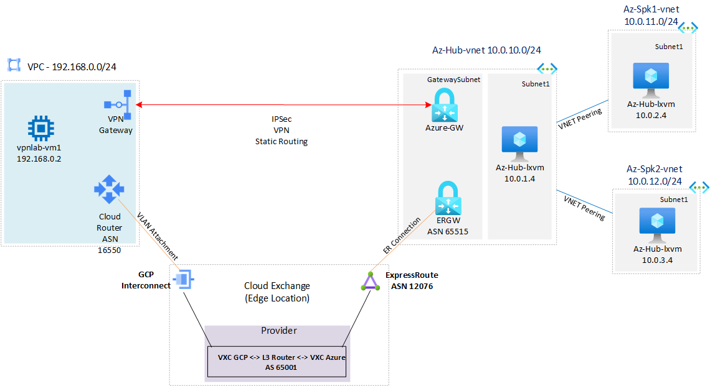
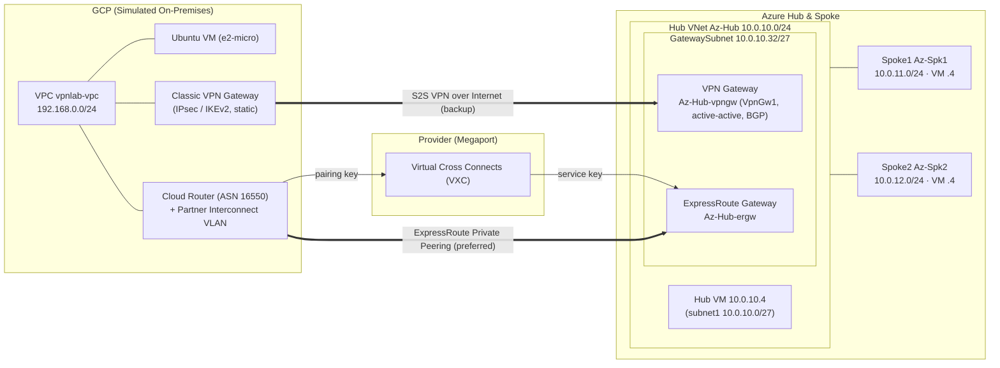

# Azure VPN / ExpressRoute Coexistence using GCP as On-Premises

A hands-on lab that demonstrates **Site-to-Site VPN and ExpressRoute coexistence** on a single
Azure Hub-and-Spoke network, using **Google Cloud (GCP)** to simulate the on-premises site.

You first establish encrypted connectivity over an **IPsec S2S VPN** (the internet path), then bring
up an **ExpressRoute** private circuit (via a Megaport/partner cross-connect to a GCP Partner
Interconnect) and observe Azure automatically **prefer ExpressRoute over VPN** — with the VPN acting
as a backup path for failover testing.

> ⚠️ **Cost warning:** This lab provisions VPN/ExpressRoute gateways, an ExpressRoute circuit, and a
> partner cross-connect (Megaport). These are **billed hourly** and the ExpressRoute portion requires
> a real provider order. Always run the **Clean up** section when finished.

## Architecture diagram



Editable source for the diagram below lives in [`media/er-vpn-coexistence.mmd`](./media/er-vpn-coexistence.mmd)
(rendered SVG: [`media/er-vpn-coexistence-diagram.svg`](./media/er-vpn-coexistence-diagram.svg)):



| Side | Components |
|------|-----------|
| **Azure** | Hub VNet (`Az-Hub`) with an **active-active VPN Gateway** (`Az-Hub-vpngw`, BGP) and an **ExpressRoute Gateway** (`Az-Hub-ergw`) sharing the `GatewaySubnet`, plus a test VM. Two spoke VNets (`Az-Spk1`, `Az-Spk2`), each peered to the hub with one VM. |
| **On-prem (GCP)** | Custom-mode VPC + subnet, a **Classic VPN gateway** (IPsec/IKEv2), and an Ubuntu test VM. For ExpressRoute, a **Cloud Router** + **Partner Interconnect** VLAN attachment. |
| **Transport** | S2S VPN over the internet (static routing) **and** ExpressRoute private peering through a partner (Megaport). |

## Address plan

| Resource | CIDR |
|----------|------|
| Azure Hub VNet | `10.0.10.0/24` |
| &nbsp;&nbsp;Hub subnet1 (VM) | `10.0.10.0/27` |
| &nbsp;&nbsp;GatewaySubnet (VPN + ER gateways) | `10.0.10.32/27` |
| Azure Spoke1 VNet | `10.0.11.0/24` (subnet `10.0.11.0/27`) |
| Azure Spoke2 VNet | `10.0.12.0/24` (subnet `10.0.12.0/27`) |
| GCP on-prem (`vpnlab`) VPC | `192.168.0.0/24` |
| GCP second site (`vpnsite2`) VPC | `192.168.100.0/24` |

## Repository layout

| File | Purpose |
|------|---------|
| [`deploy.azcli`](./deploy.azcli) | **Main lab script.** Deploys the Azure hub/spoke + gateways, the GCP on-prem VPC/VM, the S2S VPN, then the ExpressRoute + Interconnect, plus connectivity tests and cleanup. |
| [`routes.azcli`](./routes.azcli) | Validation helpers — VM effective routes, BGP peer status, learned/advertised routes for the VPN GW, ER GW, and Route Server. |
| [`vpnsite2.azcli`](./vpnsite2.azcli) | Adds a **second** GCP on-prem site to the same Azure hub VPN gateway. Reuses `$rg`/`$sharedkey` from `deploy.azcli`. |
| [`customer-demo-migration.azcli`](./customer-demo-migration.azcli) | Alternative/demo variant of the main flow (different RG name, project, and route options). |
| [`bicep/`](./bicep) | **Local trimmed Bicep template** deployed by `deploy.azcli` — hub/spokes, VPN + ER gateways, NSG and test VMs. No empty AzureFirewall/RouteServer subnets. See [`bicep/README.md`](./bicep/README.md). |
| [`azuredeploy.json`](./azuredeploy.json) | Legacy ARM template kept for reference. The lab now deploys the local Bicep instead. |

## Prerequisites

- A **Linux shell** (or Cloud Shell / WSL) with the **Azure CLI** and **gcloud** installed:
  ```bash
  curl -sL https://aka.ms/InstallAzureCLIDeb | bash   # Azure CLI
  # gcloud: https://cloud.google.com/sdk/docs/install#deb
  ```
- An **Azure subscription** and a **GCP project** with billing enabled.
- For the ExpressRoute step: an account with a connectivity provider (this lab uses **Megaport**) able
  to create Virtual Cross Connects (VXCs) to both Azure and GCP.
- Authentication:
  ```bash
  az login
  az account set --subscription "<Name or ID>"
  gcloud init
  ```

---

## Step-by-step: what `deploy.azcli` does

### 1. Variables
Sets the Azure resource group, region, your public IP (`mypip`, used to lock down SSH/firewall), and an
auto-generated **VPN shared key** (`sharedkey=$(openssl rand -base64 24)`). Defines all hub/spoke names
and CIDRs, and the GCP project/region/VPC range.

### 2. Deploy the Azure lab via local Bicep (~30 min)
```bash
az group create --name $rg --location $location
az deployment group create --resource-group $rg \
  --template-file ./bicep/main.bicep \
  --parameters vmAdminUsername=$vmuser vmAdminPassword=$vmpass restrictSshSourcePrefix=$mypip/32 \
               hubName=$AzurehubName spoke1Name=$Azurespoke1Name spoke2Name=$Azurespoke2Name ...
```
Provisions the hub (with the **active-active VPN gateway** and **ExpressRoute gateway** sharing the
`GatewaySubnet`), two spokes, and one Ubuntu VM per VNet. You are prompted for the VM username/password.
Runs with `--no-wait`. Preview first with `az deployment group what-if`. See [`bicep/README.md`](./bicep/README.md).

### 3. Build the GCP "on-premises"
- Create a custom-mode **VPC** + **subnet** (`192.168.0.0/24`).
- Create a **firewall rule** allowing TCP/UDP/ICMP from RFC1918 ranges, the GCP IAP range
  (`35.235.240.0/20`), and your `mypip`.
- Create an **Ubuntu 22.04** test VM (`e2-micro`).

### 4. Establish the Site-to-Site VPN
**GCP side (Classic VPN):** create the target VPN gateway, a static public IP, and three forwarding
rules (ESP, UDP 500, UDP 4500). Create the VPN tunnel to Azure's gateway public IP and a static route
(`10.0.0.0/8` → tunnel).

**Azure side:** create a **Local Network Gateway** representing GCP (its public IP + `192.168.0.0/24`),
wait for the VPN gateway to finish provisioning, then create the **VPN connection** using the shared key.

> 🛈 **Routing note:** This lab uses **Classic VPN with static routing**, which remains supported.
> GCP has deprecated **BGP (dynamic routing) on Classic VPN** (2025‑08‑01) and recommends **HA VPN**
> for any new dynamic-routing/SLA-backed deployments. See
> [Classic VPN deprecation](https://cloud.google.com/network-connectivity/docs/vpn/deprecations/classic-vpn-deprecation).

### 5. Verify VPN connectivity
```bash
# Azure
az network vpn-connection show -g $rg -n Azure-to-OnpremGCP --query connectionStatus -o tsv
az network vpn-connection list-ike-sas -g $rg -n Azure-to-OnpremGCP
# GCP
gcloud compute vpn-tunnels describe vpn-to-azure --region=$region --format='flattened(status,detailedStatus)'
```
Then SSH the GCP VM and `ping` each Azure VM (`10.0.10.4`, `10.0.11.4`, `10.0.12.4`).

### 6. Bring up ExpressRoute + Interconnect
**GCP:** create a **Cloud Router** (ASN `16550`) and a **Partner Interconnect** VLAN attachment; save
the **pairing key** and order a VXC to GCP through your provider.

**Azure:** create an **ExpressRoute circuit** (e.g. Megaport, 50 Mbps), order a VXC to Azure with the
**service key**, then — once the circuit is *Provisioned* — link it to the ER gateway:
```bash
erid=$(az network express-route show -n $ername -g $rg --query id -o tsv)
az network vpn-connection create --name ER-Connection-to-Onprem \
  --resource-group $rg --vnet-gateway1 $AzurehubName-ergw \
  --express-route-circuit2 $erid --routing-weight 0
```

### 7. Observe coexistence & test failover
With ER up, Azure **prefers ExpressRoute over the VPN** for the same prefixes. Keep a continuous ping
between an Azure VM and the GCP VM, then **disable ExpressRoute Private Peering** in the portal to watch
traffic **fail over to the VPN**, and re-enable to fail back.

### 8. Clean up
The end of `deploy.azcli` deletes all GCP resources (tunnel, routes, forwarding rules, gateway, IP,
interconnect, router, VM, firewall, subnet, VPC) and the Azure resource group:
```bash
az group delete -g $rg --no-wait --yes
```

---

## Validating routes (`routes.azcli`)

Run after the lab is up to inspect the control plane:
- **Effective routes** on each Azure VM NIC (`az network nic show-effective-route-table`).
- **VPN gateway** BGP peer status and learned routes.
- **ER gateway** BGP peer status, plus advertised routes per neighbor and learned routes.
- **Route Server** instance IPs.

## Adding a second on-prem site (`vpnsite2.azcli`)

Run **in the same shell** as `deploy.azcli` (it reuses `$rg` and `$sharedkey`). It builds a second GCP
VPC (`192.168.100.0/24`), VM, and Classic VPN, and a second VPN connection to the same Azure hub
gateway — useful for multi-site routing scenarios. Includes its own matching cleanup block.

## Notes & known caveats

- **Azure VM size** is now set by the local Bicep (`vmSize`, default `Standard_B1s`, Ubuntu 22.04).
- The scripts are designed to be run **interactively, block by block** (copy/paste), not as a single
  `bash script.sh` — several steps require manual provider/portal actions (VXC ordering, peering toggles).
- `customer-demo-migration.azcli` is a demo variant; prefer `deploy.azcli` for the canonical flow.

## License

See [LICENSE](./LICENSE).

---

> Analysis only — verify against vendor documentation before applying.
