# Azure VPN / ExpressRoute Coexistence using GCP as On-Premises

A hands-on lab that demonstrates **Site-to-Site VPN and ExpressRoute coexistence** on a single
Azure Hub-and-Spoke network, using **Google Cloud (GCP)** to simulate the on-premises site.

You first establish encrypted connectivity over an **IPsec S2S VPN** (the internet path), then bring
up an **ExpressRoute** private circuit (via a Megaport/partner cross-connect to a GCP Partner
Interconnect) and observe Azure automatically **prefer ExpressRoute over VPN** — with the VPN acting
as a backup path for failover testing.

This lab is **fully automated via Terraform** — no manual ARM/Bicep deployments needed.

> ⚠️ **Cost warning:** This lab provisions VPN/ExpressRoute gateways, an ExpressRoute circuit, and a
> partner cross-connect (Megaport). These are **billed hourly** and the ExpressRoute portion requires
> a real provider order. Always run the **Clean up** section when finished.

## Architecture diagram



Editable source for this diagram lives in [`media/er-vpn-coexistence.mmd`](./media/er-vpn-coexistence.mmd).

| Side | Components |
|------|-----------|
| **Azure** | Hub VNet (`Az-Hub`) with an **active-active VPN Gateway** (`Az-Hub-vpngw`, BGP) and an **ExpressRoute Gateway** (`Az-Hub-ergw`) sharing the `GatewaySubnet`, plus a test VM. Two spoke VNets (`Az-Spk1`, `Az-Spk2`), each peered to the hub with one VM. |
| **On-prem (GCP)** | Custom-mode VPC + subnet, a **Classic VPN gateway** (IPsec/IKEv2), and an Ubuntu test VM. For ExpressRoute, a **Cloud Router** + **Partner Interconnect** VLAN attachment. |
| **Transport** | S2S VPN over the internet (static routing) **and** ExpressRoute private peering through a partner (Megaport). |

## Address plan

| Resource | CIDR |
|----------|------|
| Azure Hub VNet | `10.0.10.0/24` |
| &nbsp;&nbsp;Hub subnet1 (VM) | `10.0.10.0/27` |
| &nbsp;&nbsp;GatewaySubnet (VPN + ER gateways) | `10.0.10.32/27` |
| Azure Spoke1 VNet | `10.0.11.0/24` (subnet `10.0.11.0/27`) |
| Azure Spoke2 VNet | `10.0.12.0/24` (subnet `10.0.12.0/27`) |
| GCP on-prem (`vpnlab`) VPC | `192.168.0.0/24` |
| GCP second site (`vpnsite2`) VPC | `192.168.100.0/24` |

## Repository layout

| Path | Purpose |
|------|---------|
| [`terraform/azure/`](./terraform/azure/) | **Azure Terraform module** — deploys hub/spoke VNets, VPN gateway, ExpressRoute gateway, NSGs, and test VMs. Outputs: `vpn_gateway_public_ip`, `vpn_shared_key`, `expressroute_service_key`. |
| [`terraform/gcp/`](./terraform/gcp/) | **GCP Terraform module** — deploys on-premises VPC, Classic VPN gateway, Cloud Router (optional), Partner Interconnect (optional), and test VMs. Outputs: `gcp_vpn_public_ip`, `gcp_vpc_cidr`, `interconnect_pairing_key`. |
| [`terraform/README.md`](./terraform/README.md) | **Terraform runbook** — the canonical 3-apply order, VPN verification, ExpressRoute provisioning, coexistence testing, and cleanup. **Start here.** |
| [`archive/`](./archive/) | **Legacy lab automation** — original bash/PowerShell scripts and ARM/Bicep templates now superseded by Terraform. See [`archive/README.md`](./archive/README.md). Kept for reference only. |
| [`media/`](./media/) | Architecture diagrams (Mermaid/SVG). |

## Prerequisites

| Requirement | Minimum |
|---|---|
| Terraform | ≥ 1.5 (tested with 1.15.x) |
| Azure CLI | ≥ 2.5x, authenticated with Contributor on target subscription |
| gcloud CLI | authenticated with Application Default Credentials |
| GCP project | existing project ID with billing enabled |
| Megaport account | **only needed for Step 4 (ExpressRoute/Interconnect)** — optional |

For **detailed install commands** (Windows/Linux/macOS), **auth steps**, and **permission verification**, see **[Requirements & Setup in `terraform/README.md`](./terraform/README.md#requirements--setup)**.

## Quick Start — Terraform Workflow

The lab uses a **3-apply order** to resolve circular dependencies (Azure must output its VPN gateway IP before GCP can tunnel to it; GCP must output its IP before Azure can create the Local Network Gateway):

**Step 1: Azure base** (VPN + ExpressRoute gateways, no connection yet)
```bash
cd terraform/azure
cp terraform.tfvars.example terraform.tfvars
# Edit terraform.tfvars: set vm_admin_username, vm_admin_password, restrict_ssh_source_prefix
# Leave enable_onprem_connection = false (default)
terraform plan   # Review before applying
terraform apply
```
⏱ **Gateway provisioning takes ~30–45 minutes.** Terraform may appear to hang on the gateways — this is normal. Do not cancel.

Outputs: `vpn_gateway_public_ip` (GCP will peer here), `vpn_shared_key` (sensitive).

**Step 2: GCP apply** (reads Azure state, creates tunnel)
```bash
cd ../gcp
cp terraform.tfvars.example terraform.tfvars
# Edit terraform.tfvars: set project, caller_source_ip
terraform plan   # Review before applying
terraform apply
```
Outputs: `gcp_vpn_public_ip` (Azure will peer here), `gcp_vpc_cidr`.

**Step 3: Azure connection** (creates Local Network Gateway + VPN connection)
```bash
cd ../azure
# In terraform.tfvars, set: enable_onprem_connection = true
terraform plan   # Review before applying
terraform apply
```
VPN now established. The tunnel should show `Connected` on both sides.

**Step 4 (optional): ExpressRoute + Interconnect**
Set `enable_expressroute = true` in `terraform/azure/terraform.tfvars` and `enable_interconnect = true` in `terraform/gcp/terraform.tfvars`. Retrieve the pairing keys via `terraform output -raw` and order VXCs through Megaport. See **[terraform/README.md](./terraform/README.md)** for the full provisioning flow.

---

## For full details, verification, and cleanup

→ **[See `terraform/README.md`](./terraform/README.md)** for:
- **Pre-flight checklist** — what to verify before applying
- **Requirements & Setup** — install commands, auth steps, permission checks
- **Detailed step-by-step** with all Terraform variables and examples
- **Troubleshooting** — common issues and solutions
- **VPN verification** — connection status, end-to-end ping tests
- **ExpressRoute + Interconnect** — full Megaport provisioning flow
- **Coexistence & failover testing** — observe Azure preferring ER over VPN

---

## Legacy routing helpers

The original `routes.azcli` and `routes.ps1` scripts are now archived under [`archive/`](./archive/README.md) for reference only. They provided command-line validation of:
- **Effective routes** on each Azure VM NIC.
- **VPN/ER gateway** BGP peer status and learned routes.
- **Route Server** instance IPs.

These capabilities are now integrated into the Terraform outputs and can be verified manually via `az` and `gcloud` CLI.

## Notes on GCP Classic VPN deprecation

> 🛈 **Routing note:** This lab uses **Classic VPN with static routing**, which remains supported.
> GCP has deprecated **BGP (dynamic routing) on Classic VPN** (2025‑08‑01) and recommends **HA VPN**
> for any new dynamic-routing/SLA-backed deployments. See
> [Classic VPN deprecation](https://cloud.google.com/network-connectivity/docs/vpn/deprecations/classic-vpn-deprecation).

## License

See [LICENSE](./LICENSE).

---

> Analysis only — verify against vendor documentation before applying.
